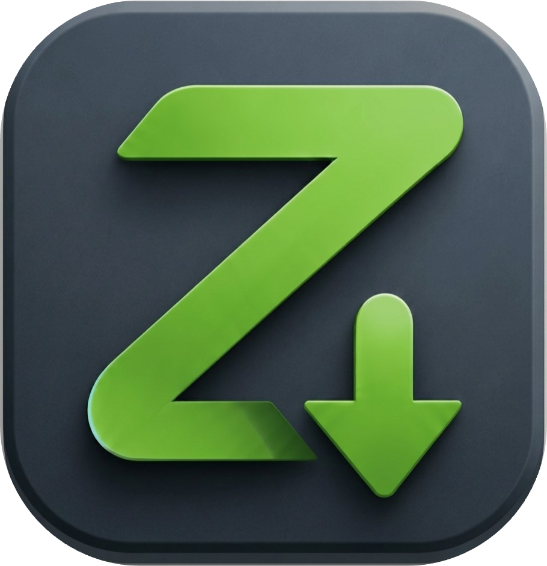

# Z Apps

### Lightweight software. Local-first. Privacy-focused.

Independent software development studio building **high-performance, resource-light native utilities for Android.**

🌐 **[z-apps.pages.dev](https://z-apps.pages.dev)**

---

## 🚀 Projects

### 🟢 Z Player (Released)

A smooth, lightweight local media player built for a fast and distraction-free experience.

* **🎵 Local Playback**  
* **⚡ Low Overhead**  
* **🛡️ Privacy First**  
* **✈️ Offline Ready**

[View Repository →](https://github.com/silenTKnight-sudo506/ZPlayer)

---

### 🟡 Project 02 (In Development)
<h1>🛠️</h1>

A next-generation Android utility focused on **daily productivity, local functionality, and privacy.**

_Coming soon._

---

### 🔵 Project 03 (Concept)
<h1>📁</h1>

An advanced **local-first file management system** designed around speed, simplicity, and user control.

_Coming soon._

---

## 💡 Philosophy

* **⚡ Zero Bloat:** No unnecessary background services, telemetry, or resource-heavy features.
* **🎨 Clear UI:** Clean interfaces designed for quick and intuitive interaction.
* **🔒 Local First:** Prefer offline functionality and local storage over unnecessary cloud dependency.

---

## 🎯 What's Next?

> **Software should respect your device, your resources, and your privacy.**

More lightweight Android utilities are currently being explored and developed.

---

## 👤 Author

**silenTKnight**

Independent developer building lightweight software and exploring:
`Android` · `Linux` · `Privacy-focused computing`

---

## 📄 License

Open source under the **[MIT License](LICENSE)**.

---
